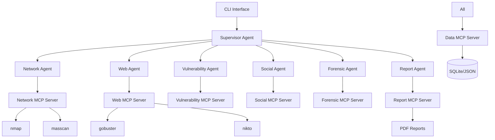

# Code Quality and Architecture

**Status**: HIGH PRIORITY - Essential for maintainability

**Target Timeline**: Weeks 5-8 (Phase 2)

---

## Overview

Current codebase has good structure but lacks comprehensive type hints, consistent error handling, and architectural documentation. Improving code quality will reduce technical debt and improve maintainability.

### Priority: HIGH
**Effort**: Medium (3-4 weeks)
**Impact**: Long-term maintainability and developer productivity

---

## 1. Add Comprehensive Type Hints

### Current State

```
Mixed type hint coverage:
✅ Some functions have type hints
❌ Many functions missing return types
❌ Complex types not properly annotated
❌ No mypy strict mode enforcement
```

### Implementation Details

#### 1.1 Supervisor Agent Type Hints

**File**: `src/agents/supervisor.py`

**Current Issues**:
- Missing type hints in orchestration methods
- Complex Dict types not properly defined
- Missing TypedDict for structured data

**Implementation**:
```python
from typing import Dict, List, Any, Optional, TypedDict, Protocol
from dataclasses import dataclass

class ScanTarget(TypedDict):
    """Type definition for scan targets."""
    host: str
    port: Optional[int]
    protocol: str
    options: Dict[str, Any]

class AgentResponse(TypedDict):
    """Type definition for agent responses."""
    agent_name: str
    status: str
    results: Dict[str, Any]
    errors: List[str]
    timestamp: str

@dataclass
class OrchestrationResult:
    """Result of agent orchestration."""
    target: ScanTarget
    responses: List[AgentResponse]
    total_time: float
    success: bool
    summary: str

async def orchestrate_scan(
    self,
    target: ScanTarget,
    scan_type: str = "comprehensive"
) -> OrchestrationResult:
    """
    Orchestrate a security scan across multiple agents.

    Args:
        target: Target information including host, port, protocol
        scan_type: Type of scan to perform (comprehensive, quick, deep)

    Returns:
        Orchestration result with all agent responses

    Raises:
        ValueError: If target is invalid
        RuntimeError: If orchestration fails
    """
    pass
```

**Files to Update**:
- `src/agents/supervisor.py` - Add TypedDict and dataclass definitions
- `src/agents/base.py` - Add Protocol definitions for agent interfaces
- `src/mcp_servers/*.py` - Add type hints to all functions
- `src/ml/*.py` - Add type hints to ML algorithms

#### 1.2 MCP Server Type Hints

**Example for Network Server**:

**File**: `src/mcp_servers/network_server.py`

```python
from typing import Dict, List, Any, Optional, Union
from pathlib import Path
from enum import Enum

class ScanFormat(str, Enum):
    """Output format for scan results."""
    JSON = "json"
    XML = "xml"
    NORMAL = "normal"

class PortScanResult(TypedDict):
    """Type definition for port scan results."""
    host: str
    ports: List[Dict[str, Any]]
    scan_time: float
    scan_type: str

async def nmap_scan(
    target: str,
    ports: Optional[str] = None,
    scan_type: str = "quick",
    output_format: ScanFormat = ScanFormat.JSON
) -> PortScanResult:
    """
    Perform nmap port scan with specified options.

    Args:
        target: Target IP or hostname
        ports: Port specification (e.g., "1-1000", "80,443")
        scan_type: Type of scan (quick, full, stealth)
        output_format: Output format for results

    Returns:
        Structured port scan results

    Raises:
        ValueError: If target is invalid
        subprocess.CalledProcessError: If nmap fails
    """
    pass
```

#### 1.3 Configure Mypy Strict Mode

**File**: `pyproject.toml`

```toml
[tool.mypy]
python_version = "3.10"
warn_return_any = true
warn_unused_configs = true
disallow_untyped_defs = true
disallow_any_unimported = true
no_implicit_optional = true
warn_redundant_casts = true
warn_unused_ignores = true
warn_no_return = true
check_untyped_defs = true
strict_equality = true
strict = true

[[tool.mypy.overrides]]
module = [
    "fastmcp.*",
    "langchain.*",
    "langgraph.*",
]
ignore_missing_imports = true
```

**Add mypy to pre-commit**:

**File**: `.pre-commit-config.yaml`

```yaml
  - repo: https://github.com/pre-commit/mirrors-mypy
    rev: v1.16.1
    hooks:
      - id: mypy
        additional_dependencies:
          - types-requests
          - types-PyYAML
        args: [--strict, --ignore-missing-imports]
```

### Acceptance Criteria
- [ ] All functions have complete type hints
- [ ] TypedDict/dataclass for complex data structures
- [ ] mypy strict mode passes with no errors
- [ ] Type hints documented in style guide
- [ ] Pre-commit hook enforces type checking

**Effort Estimate**: 1 week

---

## 2. Implement Comprehensive Error Handling

### Current State

```
Error handling is inconsistent:
✅ Basic try/except blocks exist
❌ No custom exception hierarchy
❌ Errors not logged consistently
❌ No error recovery strategies
```

### Implementation Details

#### 2.1 Custom Exception Hierarchy

**File**: `src/exceptions.py` (new file)

```python
"""Custom exceptions for kali-agents-mcp."""

class KaliAgentsError(Exception):
    """Base exception for all kali-agents-mcp errors."""

    def __init__(self, message: str, details: Optional[Dict[str, Any]] = None):
        self.message = message
        self.details = details or {}
        super().__init__(self.message)


class AgentError(KaliAgentsError):
    """Errors related to agent operations."""
    pass


class MCPServerError(KaliAgentsError):
    """Errors related to MCP server operations."""
    pass


class ToolNotFoundError(MCPServerError):
    """Raised when a required tool is not available."""

    def __init__(self, tool_name: str, install_instructions: Optional[str] = None):
        message = f"Required tool '{tool_name}' not found"
        details = {
            "tool_name": tool_name,
            "install_instructions": install_instructions
        }
        super().__init__(message, details)


class ToolExecutionError(MCPServerError):
    """Raised when tool execution fails."""

    def __init__(self, tool_name: str, exit_code: int, stderr: str):
        message = f"Tool '{tool_name}' failed with exit code {exit_code}"
        details = {
            "tool_name": tool_name,
            "exit_code": exit_code,
            "stderr": stderr
        }
        super().__init__(message, details)


class InvalidTargetError(AgentError):
    """Raised when target specification is invalid."""
    pass


class OrchestrationError(AgentError):
    """Raised when agent orchestration fails."""
    pass


class ConfigurationError(KaliAgentsError):
    """Raised when configuration is invalid."""
    pass


class AuthenticationError(KaliAgentsError):
    """Raised when authentication fails."""
    pass


class RateLimitError(KaliAgentsError):
    """Raised when API rate limit is exceeded."""

    def __init__(self, service: str, retry_after: Optional[int] = None):
        message = f"Rate limit exceeded for {service}"
        details = {
            "service": service,
            "retry_after": retry_after
        }
        super().__init__(message, details)
```

#### 2.2 Consistent Error Handling Pattern

**Example Implementation**:

**File**: `src/mcp_servers/network_server.py`

```python
import logging
from typing import Dict, Any
from src.exceptions import ToolNotFoundError, ToolExecutionError, InvalidTargetError

logger = logging.getLogger(__name__)

async def nmap_scan(target: str, **options: Any) -> Dict[str, Any]:
    """Perform nmap scan with comprehensive error handling."""

    # Input validation
    if not target or not isinstance(target, str):
        raise InvalidTargetError(f"Invalid target: {target}")

    # Check tool availability
    if not shutil.which("nmap"):
        raise ToolNotFoundError(
            tool_name="nmap",
            install_instructions="Run: sudo apt-get install nmap"
        )

    try:
        # Execute scan
        result = await execute_nmap(target, options)
        logger.info(f"Nmap scan completed for {target}")
        return result

    except subprocess.CalledProcessError as e:
        logger.error(f"Nmap execution failed: {e.stderr}")
        raise ToolExecutionError(
            tool_name="nmap",
            exit_code=e.returncode,
            stderr=e.stderr
        ) from e

    except Exception as e:
        logger.exception(f"Unexpected error during nmap scan: {str(e)}")
        raise AgentError(
            message=f"Nmap scan failed: {str(e)}",
            details={"target": target, "options": options}
        ) from e
```

#### 2.3 Error Recovery Strategies

**File**: `src/utils/retry.py` (new file)

```python
"""Retry utilities with exponential backoff."""

import asyncio
import logging
from typing import Callable, TypeVar, Optional, Type, Tuple
from functools import wraps

T = TypeVar('T')
logger = logging.getLogger(__name__)

async def retry_with_backoff(
    func: Callable[..., T],
    max_attempts: int = 3,
    initial_delay: float = 1.0,
    backoff_factor: float = 2.0,
    exceptions: Tuple[Type[Exception], ...] = (Exception,)
) -> T:
    """
    Retry async function with exponential backoff.

    Args:
        func: Async function to retry
        max_attempts: Maximum number of attempts
        initial_delay: Initial delay in seconds
        backoff_factor: Multiplier for delay on each retry
        exceptions: Tuple of exceptions to catch and retry

    Returns:
        Function result

    Raises:
        Last exception if all retries fail
    """
    delay = initial_delay
    last_exception = None

    for attempt in range(max_attempts):
        try:
            return await func()
        except exceptions as e:
            last_exception = e
            if attempt < max_attempts - 1:
                logger.warning(
                    f"Attempt {attempt + 1} failed: {str(e)}. "
                    f"Retrying in {delay}s..."
                )
                await asyncio.sleep(delay)
                delay *= backoff_factor
            else:
                logger.error(f"All {max_attempts} attempts failed")

    raise last_exception

def retry_on_failure(
    max_attempts: int = 3,
    exceptions: Tuple[Type[Exception], ...] = (Exception,)
):
    """Decorator for retry with exponential backoff."""
    def decorator(func: Callable) -> Callable:
        @wraps(func)
        async def wrapper(*args, **kwargs):
            return await retry_with_backoff(
                lambda: func(*args, **kwargs),
                max_attempts=max_attempts,
                exceptions=exceptions
            )
        return wrapper
    return decorator
```

**Usage Example**:
```python
from src.utils.retry import retry_on_failure
from src.exceptions import RateLimitError

@retry_on_failure(max_attempts=3, exceptions=(RateLimitError,))
async def shodan_search(query: str) -> Dict[str, Any]:
    """Search Shodan with automatic retry on rate limit."""
    # Implementation
    pass
```

### Acceptance Criteria
- [ ] Custom exception hierarchy implemented
- [ ] All MCP servers use custom exceptions
- [ ] Error logging consistent across all modules
- [ ] Retry logic for network operations
- [ ] Error documentation in API docs
- [ ] Unit tests for error scenarios

**Effort Estimate**: 1 week

---

## 3. Code Style and Formatting

### Current State

```
✅ Black formatting configured
✅ isort for import sorting
❌ Flake8 not enforced in CI
❌ No code complexity checks
❌ Inconsistent docstring format
```

### Implementation Details

#### 3.1 Enforce Flake8 in CI

**File**: `.github/workflows/tests.yml`

```yaml
- name: Lint with flake8
  run: |
    flake8 src tests --count --select=E9,F63,F7,F82 --show-source --statistics
    flake8 src tests --count --max-complexity=10 --max-line-length=88 --statistics
```

#### 3.2 Configure Code Complexity Limits

**File**: `pyproject.toml`

```toml
[tool.flake8]
max-line-length = 88
max-complexity = 10
ignore = ["E203", "E266", "E501", "W503"]
exclude = [".git", "__pycache__", "build", "dist", ".venv"]

[tool.pylint.messages_control]
max-line-length = 88
disable = ["C0111", "C0103"]

[tool.pylint.design]
max-args = 7
max-locals = 15
max-returns = 6
max-branches = 12
max-statements = 50
```

#### 3.3 Standardize Docstring Format

**Use Google-style docstrings**:

```python
def function_with_types_in_docstring(param1: int, param2: str) -> bool:
    """Example function with Google-style docstrings.

    Args:
        param1: The first parameter.
        param2: The second parameter.

    Returns:
        The return value. True for success, False otherwise.

    Raises:
        ValueError: If param1 is negative.
        RuntimeError: If operation fails.

    Example:
        >>> function_with_types_in_docstring(1, "test")
        True
    """
    pass
```

**Add to pre-commit**:

```yaml
  - repo: https://github.com/pycqa/pydocstyle
    rev: 6.3.0
    hooks:
      - id: pydocstyle
        args: [--convention=google]
```

### Acceptance Criteria
- [ ] Flake8 enforced in CI
- [ ] Complexity limits configured
- [ ] All functions have Google-style docstrings
- [ ] Pre-commit hooks for all linters
- [ ] Documentation style guide created

**Effort Estimate**: 3-4 days

---

## 4. Architectural Documentation

### Current State

```
❌ No architecture diagrams
❌ No component interaction documentation
❌ No design decision records
```

### Implementation Details

#### 4.1 Architecture Diagrams

**File**: `docs/architecture/system-overview.md`

Create diagrams for:
1. **System Architecture** - Overall component layout
2. **MCP Server Communication** - How servers interact
3. **Agent Orchestration Flow** - Supervisor → Agents → Tools
4. **Data Flow** - From scan to report
5. **ML Decision Making** - How ML algorithms choose actions

**Use Mermaid for diagrams**:

```markdown
## System Architecture



#### 4.2 Design Decision Records (ADRs)

**File**: `docs/architecture/decisions/README.md`

Create ADRs for major decisions:

**File**: `docs/architecture/decisions/001-mcp-architecture.md`

```markdown
# ADR 001: MCP Architecture for Agent Communication

## Status
Accepted

## Context
We need a way for specialized security agents to communicate with tools and each other. The system should be extensible and maintainable.

## Decision
Use Model Context Protocol (MCP) architecture where each specialized agent has its own MCP server that interfaces with security tools.

## Consequences

### Positive
- Clear separation of concerns
- Easy to add new agents
- Tools isolated in their own servers
- Testable in isolation

### Negative
- More complex than monolithic design
- Requires understanding MCP protocol
- Additional network overhead

## Alternatives Considered
- Direct tool execution from agents
- Monolithic agent with all tools
- REST API for each tool
```

**Create ADRs for**:
- 001-mcp-architecture.md
- 002-ml-orchestration.md
- 003-langchain-integration.md
- 004-fastapi-framework.md
- 005-sqlite-vs-postgres.md

#### 4.3 Component Documentation

**Files to Create**:
- `docs/architecture/supervisor-agent.md` - Supervisor orchestration logic
- `docs/architecture/ml-algorithms.md` - ML algorithm details
- `docs/architecture/mcp-servers.md` - MCP server specifications
- `docs/architecture/data-storage.md` - Data persistence strategy
- `docs/architecture/report-generation.md` - Report creation flow

### Acceptance Criteria
- [ ] System architecture diagram created
- [ ] 5+ ADRs documenting major decisions
- [ ] Component documentation for each major module
- [ ] Data flow diagrams
- [ ] ML decision-making documentation
- [ ] All diagrams in Mermaid format

**Effort Estimate**: 1 week

---

## 5. Refactor Large Functions

### Current State

Some functions are too large and do too many things. Need to break them down.

### Implementation Details

#### 5.1 Identify Complex Functions

**Run complexity analysis**:
```bash
flake8 src --max-complexity=10
radon cc src -a -nb
```

**Target refactoring**:
- Functions > 50 lines
- Cyclomatic complexity > 10
- Functions with > 7 parameters

#### 5.2 Refactoring Examples

**Before** (src/agents/supervisor.py):
```python
async def orchestrate_scan(self, target, options):
    # 100+ lines of orchestration logic
    # ML algorithm selection
    # Agent coordination
    # Result aggregation
    # Error handling
    # Report generation
    pass
```

**After**:
```python
async def orchestrate_scan(
    self,
    target: ScanTarget,
    options: OrchestrationOptions
) -> OrchestrationResult:
    """Orchestrate security scan across multiple agents."""
    # Validate input
    self._validate_target(target)

    # Select strategy
    strategy = await self._select_strategy(target, options)

    # Execute agents
    responses = await self._execute_agents(target, strategy)

    # Aggregate results
    results = self._aggregate_results(responses)

    # Generate summary
    summary = await self._generate_summary(results)

    return OrchestrationResult(
        target=target,
        responses=responses,
        results=results,
        summary=summary
    )

async def _select_strategy(
    self,
    target: ScanTarget,
    options: OrchestrationOptions
) -> ScanStrategy:
    """Select optimal scan strategy using ML algorithms."""
    # Separate ML logic
    pass

async def _execute_agents(
    self,
    target: ScanTarget,
    strategy: ScanStrategy
) -> List[AgentResponse]:
    """Execute agents according to strategy."""
    # Separate agent execution
    pass
```

### Acceptance Criteria
- [ ] No functions > 50 lines
- [ ] Cyclomatic complexity < 10
- [ ] Max 7 parameters per function
- [ ] Complex logic extracted to helper methods
- [ ] All refactored code has tests

**Effort Estimate**: 1 week

---

## 6. Configuration Management

### Current State

```
✅ Environment variables for secrets
❌ No configuration file validation
❌ Hard-coded values in code
❌ No configuration schema
```

### Implementation Details

#### 6.1 Configuration Schema

**File**: `src/config/schema.py` (new file)

```python
"""Configuration schema using Pydantic."""

from typing import Optional, Dict, Any, List
from pydantic import BaseModel, Field, validator
from pathlib import Path

class MCPServerConfig(BaseModel):
    """Configuration for MCP servers."""
    host: str = Field(default="localhost")
    port: int = Field(default=8000, gt=0, lt=65536)
    timeout: int = Field(default=30, gt=0)
    max_retries: int = Field(default=3, ge=0)

class MLConfig(BaseModel):
    """Configuration for ML algorithms."""
    fuzzy_logic_enabled: bool = True
    genetic_algorithm_enabled: bool = True
    qlearning_enabled: bool = True
    default_algorithm: str = Field(default="fuzzy_logic")

    @validator('default_algorithm')
    def validate_algorithm(cls, v):
        valid = ['fuzzy_logic', 'genetic_algorithm', 'qlearning']
        if v not in valid:
            raise ValueError(f"Algorithm must be one of {valid}")
        return v

class SecurityConfig(BaseModel):
    """Security-related configuration."""
    api_keys: Dict[str, str] = Field(default_factory=dict)
    rate_limits: Dict[str, int] = Field(default_factory=dict)
    max_concurrent_scans: int = Field(default=5, gt=0)

class AppConfig(BaseModel):
    """Main application configuration."""
    debug: bool = False
    log_level: str = Field(default="INFO")
    data_dir: Path = Field(default=Path("data"))
    mcp_servers: MCPServerConfig = Field(default_factory=MCPServerConfig)
    ml: MLConfig = Field(default_factory=MLConfig)
    security: SecurityConfig = Field(default_factory=SecurityConfig)

    @validator('log_level')
    def validate_log_level(cls, v):
        valid = ['DEBUG', 'INFO', 'WARNING', 'ERROR', 'CRITICAL']
        if v.upper() not in valid:
            raise ValueError(f"Log level must be one of {valid}")
        return v.upper()

    class Config:
        env_file = ".env"
        env_file_encoding = "utf-8"
```

#### 6.2 Configuration Loading

**File**: `src/config/__init__.py`

```python
"""Configuration management."""

import os
import yaml
from pathlib import Path
from typing import Optional
from .schema import AppConfig

def load_config(config_path: Optional[Path] = None) -> AppConfig:
    """
    Load configuration from file and environment variables.

    Environment variables override config file values.

    Args:
        config_path: Path to config file (default: config.yaml)

    Returns:
        Validated application configuration
    """
    if config_path is None:
        config_path = Path("config.yaml")

    # Load from file if exists
    config_dict = {}
    if config_path.exists():
        with open(config_path) as f:
            config_dict = yaml.safe_load(f) or {}

    # Override with environment variables
    if os.getenv("DEBUG"):
        config_dict["debug"] = os.getenv("DEBUG").lower() == "true"

    if os.getenv("LOG_LEVEL"):
        config_dict["log_level"] = os.getenv("LOG_LEVEL")

    # Validate and return
    return AppConfig(**config_dict)

# Global config instance
config: Optional[AppConfig] = None

def get_config() -> AppConfig:
    """Get global configuration instance."""
    global config
    if config is None:
        config = load_config()
    return config
```

#### 6.3 Example Configuration File

**File**: `config.yaml.example`

```yaml
# Kali Agents MCP Configuration
# Copy to config.yaml and customize

debug: false
log_level: INFO
data_dir: ./data

mcp_servers:
  host: localhost
  port: 8000
  timeout: 30
  max_retries: 3

ml:
  fuzzy_logic_enabled: true
  genetic_algorithm_enabled: true
  qlearning_enabled: true
  default_algorithm: fuzzy_logic

security:
  max_concurrent_scans: 5
  rate_limits:
    shodan_api: 100  # requests per day
    virustotal_api: 500
```

### Acceptance Criteria
- [ ] Pydantic schema for all configuration
- [ ] Configuration validation on startup
- [ ] Example config file created
- [ ] Environment variable overrides work
- [ ] Configuration documentation
- [ ] Config validation tests

**Effort Estimate**: 4-5 days

---

## Related Issues

- GitHub issues with label `code-quality`
- Milestone: Phase 2 - Code Quality

---

## Success Metrics

### Code Quality Metrics
- [ ] 100% type hint coverage (mypy strict passes)
- [ ] Max cyclomatic complexity ≤ 10
- [ ] Max function length ≤ 50 lines
- [ ] 100% docstring coverage
- [ ] Zero flake8 violations

### Architecture Metrics
- [ ] 5+ ADRs documented
- [ ] All major components documented
- [ ] Architecture diagrams complete
- [ ] Configuration schema validated

**Total Effort Estimate**: 3-4 weeks
