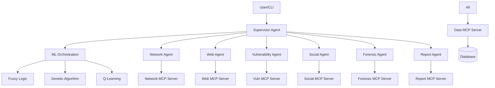

# Documentation

**Status**: MEDIUM PRIORITY - Essential for adoption and maintenance

**Target Timeline**: Weeks 9-12 (Phase 2-3)

---

## Overview

Current documentation is basic and needs significant expansion. Good documentation is critical for user adoption, contributor onboarding, and long-term maintenance.

### Priority: MEDIUM
**Effort**: Medium (3-4 weeks)
**Impact**: User adoption, contributor onboarding, maintenance efficiency

### Current State

```
Documentation Status:
✅ Basic README.md
✅ SECURITY.md
✅ CONTRIBUTING.md
❌ No API documentation
❌ No architecture documentation
❌ No user guide
❌ No examples/tutorials
❌ No MCP server documentation
```

---

## 1. API Documentation

### Current State

```
❌ No API reference documentation
❌ No OpenAPI/Swagger spec
❌ Function signatures not documented
```

### Implementation Details

#### 1.1 OpenAPI Specification

**File**: `src/api/main.py`

```python
"""FastAPI application with comprehensive OpenAPI documentation."""

from fastapi import FastAPI
from fastapi.openapi.utils import get_openapi

app = FastAPI(
    title="Kali Agents MCP API",
    description="""
    Multi-Agent Cybersecurity Platform with ML-based orchestration.

    ## Features

    * **Network Scanning**: Nmap, Masscan integration
    * **Web Scanning**: Gobuster, Nikto, SQLMap
    * **Vulnerability Assessment**: Automated vulnerability detection
    * **OSINT**: Social engineering and information gathering
    * **Forensics**: Digital forensics and memory analysis
    * **Report Generation**: Professional penetration testing reports

    ## Authentication

    API key required for all endpoints. Include in header:
    ```
    Authorization: Bearer YOUR_API_KEY
    ```
    """,
    version="0.1.0",
    contact={
        "name": "Kali Agents Team",
        "url": "https://github.com/Huleinpylo/kali-agents-mcp",
    },
    license_info={
        "name": "MIT",
        "url": "https://opensource.org/licenses/MIT",
    },
)

def custom_openapi():
    """Generate custom OpenAPI schema."""
    if app.openapi_schema:
        return app.openapi_schema

    openapi_schema = get_openapi(
        title=app.title,
        version=app.version,
        description=app.description,
        routes=app.routes,
    )

    # Add security scheme
    openapi_schema["components"]["securitySchemes"] = {
        "BearerAuth": {
            "type": "http",
            "scheme": "bearer",
            "bearerFormat": "API Key",
        }
    }

    # Add tags
    openapi_schema["tags"] = [
        {
            "name": "network",
            "description": "Network scanning operations",
        },
        {
            "name": "web",
            "description": "Web application scanning",
        },
        {
            "name": "vulnerability",
            "description": "Vulnerability assessment",
        },
        {
            "name": "social",
            "description": "OSINT and social engineering",
        },
        {
            "name": "forensic",
            "description": "Digital forensics",
        },
        {
            "name": "report",
            "description": "Report generation",
        },
    ]

    app.openapi_schema = openapi_schema
    return app.openapi_schema

app.openapi = custom_openapi
```

#### 1.2 Endpoint Documentation

**File**: `src/api/routers/network.py`

```python
"""Network scanning API endpoints with comprehensive documentation."""

from fastapi import APIRouter, HTTPException, Query, Body
from typing import Optional, List
from pydantic import BaseModel, Field

router = APIRouter(prefix="/network", tags=["network"])

class ScanRequest(BaseModel):
    """Network scan request model."""

    target: str = Field(
        ...,
        description="Target IP address, hostname, or CIDR range",
        example="192.168.1.1"
    )
    ports: Optional[str] = Field(
        None,
        description="Port specification (e.g., '80,443' or '1-1000')",
        example="1-1000"
    )
    scan_type: str = Field(
        default="quick",
        description="Type of scan to perform",
        example="quick"
    )
    options: Optional[dict] = Field(
        default_factory=dict,
        description="Additional scan options"
    )

    class Config:
        schema_extra = {
            "example": {
                "target": "192.168.1.1",
                "ports": "80,443,8080",
                "scan_type": "stealth",
                "options": {
                    "timing": "aggressive",
                    "service_detection": True
                }
            }
        }

class PortInfo(BaseModel):
    """Information about a single port."""
    port: int = Field(..., description="Port number")
    state: str = Field(..., description="Port state (open, closed, filtered)")
    service: Optional[str] = Field(None, description="Service name")
    version: Optional[str] = Field(None, description="Service version")

class ScanResult(BaseModel):
    """Network scan result model."""

    scan_id: str = Field(..., description="Unique scan identifier")
    target: str = Field(..., description="Scanned target")
    timestamp: str = Field(..., description="Scan timestamp (ISO 8601)")
    ports: List[PortInfo] = Field(..., description="List of discovered ports")
    scan_time: float = Field(..., description="Scan duration in seconds")
    status: str = Field(..., description="Scan status")

@router.post(
    "/scan",
    response_model=ScanResult,
    summary="Perform network scan",
    description="""
    Execute a network port scan using nmap or masscan.

    ## Scan Types

    - **quick**: Fast scan of common ports (1-1000)
    - **full**: Comprehensive scan of all ports (1-65535)
    - **stealth**: SYN stealth scan to avoid detection
    - **aggressive**: Aggressive scan with OS detection

    ## Rate Limiting

    Maximum 10 concurrent scans per API key.

    ## Notes

    - Large scans may take several minutes
    - Results are stored for 30 days
    - Use WebSocket endpoint for real-time progress
    """,
    responses={
        200: {
            "description": "Scan completed successfully",
            "content": {
                "application/json": {
                    "example": {
                        "scan_id": "scan_abc123",
                        "target": "192.168.1.1",
                        "timestamp": "2024-01-01T00:00:00Z",
                        "ports": [
                            {
                                "port": 22,
                                "state": "open",
                                "service": "ssh",
                                "version": "OpenSSH 8.2"
                            }
                        ],
                        "scan_time": 45.2,
                        "status": "completed"
                    }
                }
            }
        },
        400: {"description": "Invalid target or parameters"},
        429: {"description": "Rate limit exceeded"},
        500: {"description": "Scan execution failed"}
    }
)
async def network_scan(
    request: ScanRequest = Body(...),
    background: bool = Query(
        default=False,
        description="Run scan in background"
    )
) -> ScanResult:
    """Execute network port scan."""
    # Implementation
    pass
```

#### 1.3 Generate Documentation Site

**Use MkDocs with Material theme**:

**File**: `mkdocs.yml`

```yaml
site_name: Kali Agents MCP Documentation
site_description: Multi-Agent Cybersecurity Platform
site_author: Kali Agents Team
site_url: https://huleinpylo.github.io/kali-agents-mcp/

repo_name: Huleinpylo/kali-agents-mcp
repo_url: https://github.com/Huleinpylo/kali-agents-mcp

theme:
  name: material
  palette:
    - scheme: default
      primary: indigo
      accent: indigo
      toggle:
        icon: material/brightness-7
        name: Switch to dark mode
    - scheme: slate
      primary: indigo
      accent: indigo
      toggle:
        icon: material/brightness-4
        name: Switch to light mode
  features:
    - navigation.tabs
    - navigation.sections
    - navigation.expand
    - navigation.top
    - search.suggest
    - search.highlight
    - content.code.annotate

plugins:
  - search
  - mkdocstrings:
      handlers:
        python:
          options:
            docstring_style: google
            show_source: true

markdown_extensions:
  - pymdownx.highlight
  - pymdownx.superfences
  - pymdownx.tabbed
  - admonition
  - codehilite
  - toc:
      permalink: true

nav:
  - Home: index.md
  - Getting Started:
      - Installation: getting-started/installation.md
      - Quick Start: getting-started/quickstart.md
      - Configuration: getting-started/configuration.md
  - User Guide:
      - CLI Usage: user-guide/cli.md
      - Network Scanning: user-guide/network-scanning.md
      - Web Scanning: user-guide/web-scanning.md
      - Vulnerability Assessment: user-guide/vulnerability.md
      - OSINT: user-guide/osint.md
      - Forensics: user-guide/forensics.md
      - Report Generation: user-guide/reports.md
  - API Reference:
      - Overview: api/overview.md
      - Network API: api/network.md
      - Web API: api/web.md
      - Vulnerability API: api/vulnerability.md
      - Social API: api/social.md
      - Forensic API: api/forensic.md
      - Report API: api/report.md
  - Architecture:
      - System Overview: architecture/overview.md
      - MCP Servers: architecture/mcp-servers.md
      - ML Orchestration: architecture/ml-orchestration.md
      - Design Decisions: architecture/decisions.md
  - Development:
      - Contributing: development/contributing.md
      - Code Style: development/code-style.md
      - Testing: development/testing.md
      - Security: development/security.md
  - Tutorials:
      - Basic Scan: tutorials/basic-scan.md
      - Custom Agent: tutorials/custom-agent.md
      - Report Template: tutorials/report-template.md
```

### Acceptance Criteria
- [ ] OpenAPI spec complete and accurate
- [ ] All endpoints documented with examples
- [ ] MkDocs site generated
- [ ] API docs accessible via /docs endpoint
- [ ] Request/response models documented

**Effort Estimate**: 1 week

---

## 2. User Documentation

### Implementation Details

#### 2.1 Installation Guide

**File**: `docs/getting-started/installation.md`

```markdown
# Installation Guide

## Prerequisites

- Python 3.10 or higher
- Docker (for containerized deployment)
- Kali Linux tools (for full functionality)

## Installation Methods

### pip Installation (Recommended)

```bash
# Install from PyPI (when published)
pip install kali-agents-mcp

# Or install from source
git clone https://github.com/Huleinpylo/kali-agents-mcp.git
cd kali-agents-mcp
pip install -e .
```

### Docker Installation

```bash
# Pull pre-built image
docker pull huleinpylo/kali-agents-mcp:latest

# Or build from source
docker build -t kali-agents-mcp .

# Run container
docker run -p 8000:8000 kali-agents-mcp
```

### Development Installation

```bash
# Clone repository
git clone https://github.com/Huleinpylo/kali-agents-mcp.git
cd kali-agents-mcp

# Create virtual environment
python -m venv .venv
source .venv/bin/activate  # On Windows: .venv\Scripts\activate

# Install dependencies
pip install -r requirements-dev.txt

# Run tests
./test.sh
```

## Kali Linux Tools

The following tools should be installed for full functionality:

### Network Tools
- nmap
- masscan
- netcat

### Web Tools
- gobuster
- nikto
- sqlmap
- dirb

### Vulnerability Tools
- metasploit
- nuclei
- searchsploit

### OSINT Tools
- theHarvester
- recon-ng
- spiderfoot

### Forensic Tools
- volatility
- binwalk
- foremost
- tshark

### Installation Command (Kali Linux)

```bash
sudo apt-get update
sudo apt-get install -y nmap masscan netcat-traditional \
    gobuster nikto sqlmap dirb metasploit-framework \
    theharvester recon-ng volatility3 binwalk foremost \
    wireshark-common
```

## Configuration

1. **Create configuration file**:
   ```bash
   cp config.yaml.example config.yaml
   ```

2. **Set environment variables**:
   ```bash
   export OPENAI_API_KEY="your-key-here"
   export SHODAN_API_KEY="your-key-here"
   export VIRUSTOTAL_API_KEY="your-key-here"
   ```

3. **Verify installation**:
   ```bash
   kali-agents --version
   kali-agents doctor  # Check tool availability
   ```

## Troubleshooting

### Common Issues

**Import Errors**:
```bash
# Reinstall dependencies
pip install --force-reinstall -r requirements.txt
```

**Tool Not Found**:
```bash
# Check tool availability
kali-agents doctor
# Install missing tools as shown above
```

**Permission Errors**:
```bash
# Some tools require root privileges
sudo kali-agents scan --target 192.168.1.1
```
```

#### 2.2 Quick Start Guide

**File**: `docs/getting-started/quickstart.md`

```markdown
# Quick Start Guide

Get started with Kali Agents MCP in 5 minutes!

## Your First Scan

### 1. Run a Network Scan

```bash
kali-agents scan network --target scanme.nmap.org
```

This will:
- Scan common ports (1-1000)
- Identify running services
- Store results in database
- Display summary

### 2. View Results

```bash
# List recent scans
kali-agents scans list

# View specific scan
kali-agents scans show <scan-id>

# Export to JSON
kali-agents scans export <scan-id> --format json
```

### 3. Generate Report

```bash
# Generate PDF report
kali-agents report generate <scan-id> --format pdf --output report.pdf

# Generate HTML report
kali-agents report generate <scan-id> --format html --output report.html
```

## Common Workflows

### Comprehensive Website Assessment

```bash
# 1. Network scan
kali-agents scan network --target example.com

# 2. Web application scan
kali-agents scan web --target https://example.com

# 3. Vulnerability assessment
kali-agents scan vuln --target example.com

# 4. Generate combined report
kali-agents report generate --all --format pdf
```

### Quick Port Check

```bash
kali-agents scan network \
    --target 192.168.1.1 \
    --ports 80,443,8080 \
    --fast
```

### OSINT on Domain

```bash
kali-agents scan social \
    --target example.com \
    --sources shodan,harvester,recon-ng
```

## Using the API

### Start API Server

```bash
kali-agents serve --host 0.0.0.0 --port 8000
```

### Make API Request

```bash
curl -X POST http://localhost:8000/network/scan \
    -H "Content-Type: application/json" \
    -d '{
        "target": "192.168.1.1",
        "ports": "1-1000",
        "scan_type": "quick"
    }'
```

### Interactive API Docs

Visit http://localhost:8000/docs for interactive API documentation.

## Next Steps

- [Configuration Guide](configuration.md) - Customize behavior
- [CLI Reference](../user-guide/cli.md) - Full CLI documentation
- [API Reference](../api/overview.md) - Complete API documentation
- [Tutorials](../tutorials/basic-scan.md) - Step-by-step tutorials
```

#### 2.3 User Guide

Create comprehensive guides for each feature:

**Files**:
- `docs/user-guide/cli.md` - Complete CLI reference
- `docs/user-guide/network-scanning.md` - Network scanning guide
- `docs/user-guide/web-scanning.md` - Web application scanning
- `docs/user-guide/vulnerability.md` - Vulnerability assessment
- `docs/user-guide/osint.md` - OSINT and reconnaissance
- `docs/user-guide/forensics.md` - Digital forensics
- `docs/user-guide/reports.md` - Report generation and customization

### Acceptance Criteria
- [ ] Installation guide complete
- [ ] Quick start guide tested
- [ ] User guide for each major feature
- [ ] Screenshots and examples included
- [ ] Troubleshooting section

**Effort Estimate**: 1.5 weeks

---

## 3. Architecture Documentation

### Implementation Details

#### 3.1 System Overview

**File**: `docs/architecture/overview.md`

```markdown
# System Architecture

## High-Level Overview

Kali Agents MCP uses a multi-agent architecture where specialized agents coordinate through a supervisor using machine learning algorithms.



## Core Components

### 1. Supervisor Agent
- **Responsibility**: Orchestrate security assessments
- **ML Integration**: Uses fuzzy logic, genetic algorithms, and Q-learning
- **Decision Making**: Selects which agents to activate
- **Priority**: Determines scan depth and thoroughness

### 2. Specialized Agents
Each agent focuses on a specific security domain:
- **Network Agent**: Port scanning, service detection
- **Web Agent**: Web application testing, directory enumeration
- **Vulnerability Agent**: Exploit search, vulnerability scanning
- **Social Agent**: OSINT, information gathering
- **Forensic Agent**: Memory forensics, file analysis

### 3. MCP Servers
Model Context Protocol servers provide tool integration:
- **Isolated Execution**: Each tool runs in its own context
- **Standardized Interface**: Consistent API across all tools
- **Error Handling**: Robust error management
- **Output Parsing**: Structured data extraction

### 4. Data Layer
- **Storage**: SQLite for scan results and history
- **Caching**: Redis for temporary data (optional)
- **Export**: JSON, CSV, XML formats

## Communication Flow

1. **User Input** → CLI parses command
2. **Supervisor** receives task
3. **ML Algorithm** selects strategy
4. **Agents** activated based on strategy
5. **MCP Servers** execute tools
6. **Results** aggregated and stored
7. **Report** generated and delivered

## Security Considerations

- **Isolation**: Tools run in isolated contexts
- **Validation**: All inputs validated before execution
- **Sanitization**: Outputs sanitized before storage
- **Auditing**: All actions logged
```

#### 3.2 MCP Server Documentation

**File**: `docs/architecture/mcp-servers.md`

Include detailed documentation of each MCP server's API, tools, and usage.

#### 3.3 ML Orchestration

**File**: `docs/architecture/ml-orchestration.md`

Document how ML algorithms make decisions and coordinate agents.

### Acceptance Criteria
- [ ] System architecture diagram
- [ ] Component descriptions
- [ ] Data flow documentation
- [ ] Security architecture
- [ ] ML decision-making process documented

**Effort Estimate**: 1 week

---

## 4. Developer Documentation

### Implementation Details

#### 4.1 Contributing Guide

**File**: `CONTRIBUTING.md` (enhance existing)

Add sections:
- Development setup
- Code style guide
- Testing requirements
- PR process
- Review checklist

#### 4.2 Code Examples

**File**: `docs/development/examples.md`

```markdown
# Code Examples

## Creating a Custom Agent

```python
from src.agents.base import BaseAgent
from typing import Dict, Any

class CustomAgent(BaseAgent):
    """Custom security agent."""

    def __init__(self):
        super().__init__(name="custom")
        self.mcp_server = CustomMCPServer()

    async def scan(self, target: str, options: Dict[str, Any]) -> Dict[str, Any]:
        """Execute custom scan."""
        # Validate target
        if not self.validate_target(target):
            raise ValueError(f"Invalid target: {target}")

        # Execute scan via MCP server
        result = await self.mcp_server.custom_scan(target, **options)

        # Store results
        await self.store_results(result)

        return result
```

## Creating a Custom MCP Server

```python
from fastmcp import FastMCP
from typing import Dict, Any

mcp = FastMCP("Custom Server")

@mcp.tool()
async def custom_tool(
    target: str,
    option1: str = "default"
) -> Dict[str, Any]:
    """
    Execute custom security tool.

    Args:
        target: Target to scan
        option1: Custom option

    Returns:
        Scan results
    """
    # Implementation
    result = await execute_tool(target, option1)
    return parse_output(result)
```

## Adding a New ML Algorithm

```python
from src.ml.base import BaseMLAlgorithm

class CustomMLAlgorithm(BaseMLAlgorithm):
    """Custom ML algorithm for agent selection."""

    def train(self, data: List[Dict]) -> None:
        """Train the model."""
        # Implementation
        pass

    def predict(self, features: Dict[str, Any]) -> Dict[str, Any]:
        """Make prediction."""
        # Implementation
        return {"decision": "action", "confidence": 0.8}
```
```

#### 4.3 Testing Guide

**File**: `docs/development/testing.md`

Complete guide on writing and running tests.

### Acceptance Criteria
- [ ] Contributing guide enhanced
- [ ] Code examples for common tasks
- [ ] Testing guide complete
- [ ] Development best practices documented
- [ ] API extension guide

**Effort Estimate**: 4-5 days

---

## 5. Tutorial Content

### Implementation Details

#### 5.1 Basic Tutorials

**File**: `docs/tutorials/basic-scan.md`

```markdown
# Tutorial: Your First Security Scan

In this tutorial, you'll learn how to perform a basic security scan and generate a report.

## Prerequisites

- Kali Agents MCP installed
- Basic command line knowledge

## Step 1: Scan a Target

Let's scan a test target (scanme.nmap.org):

```bash
kali-agents scan network --target scanme.nmap.org --ports 1-1000
```

You'll see output like:

```
[INFO] Starting network scan...
[INFO] Target: scanme.nmap.org
[INFO] Ports: 1-1000
[INFO] Scan type: quick

[PROGRESS] Scanning... 25%
[PROGRESS] Scanning... 50%
[PROGRESS] Scanning... 75%
[PROGRESS] Scanning... 100%

[SUCCESS] Scan completed in 45.2 seconds

Results:
  - Port 22: OPEN (ssh)
  - Port 80: OPEN (http)

Scan ID: scan_abc123
```

## Step 2: View Detailed Results

```bash
kali-agents scans show scan_abc123
```

## Step 3: Generate Report

```bash
kali-agents report generate scan_abc123 --format pdf --output my-first-scan.pdf
```

## Step 4: Review the Report

Open `my-first-scan.pdf` to see:
- Executive summary
- Port scan results
- Service information
- Recommendations

## Next Steps

- Try different scan types: `--scan-type full`
- Scan multiple targets
- Combine multiple scan types
```

Create tutorials for:
- Basic scan workflow
- Creating custom agents
- Custom report templates
- API integration
- ML algorithm customization

### Acceptance Criteria
- [ ] 5+ step-by-step tutorials
- [ ] Code examples tested
- [ ] Screenshots included
- [ ] Expected output shown
- [ ] Troubleshooting tips

**Effort Estimate**: 1 week

---

## 6. Documentation Infrastructure

### Implementation Details

#### 6.1 Documentation CI/CD

**File**: `.github/workflows/docs.yml`

```yaml
name: Documentation

on:
  push:
    branches: [main]
    paths:
      - 'docs/**'
      - 'mkdocs.yml'
  pull_request:
    paths:
      - 'docs/**'
      - 'mkdocs.yml'

jobs:
  build:
    runs-on: ubuntu-latest
    steps:
      - uses: actions/checkout@v4

      - name: Set up Python
        uses: actions/setup-python@v5
        with:
          python-version: '3.11'

      - name: Install dependencies
        run: |
          pip install mkdocs mkdocs-material mkdocstrings[python]

      - name: Build docs
        run: mkdocs build --strict

      - name: Deploy to GitHub Pages
        if: github.ref == 'refs/heads/main'
        run: mkdocs gh-deploy --force
```

#### 6.2 Documentation Version

**Generate API docs from code**:

```bash
# Install sphinx
pip install sphinx sphinx-rtd-theme sphinx-autodoc-typehints

# Generate docs
sphinx-apidoc -o docs/api src/

# Build HTML
cd docs && make html
```

### Acceptance Criteria
- [ ] Docs build automatically
- [ ] Docs deployed to GitHub Pages
- [ ] API docs auto-generated
- [ ] Links validated
- [ ] Search functionality works

**Effort Estimate**: 3-4 days

---

## Related Issues

- GitHub issues with label `documentation`
- Milestone: Phase 2-3 - Documentation

---

## Success Metrics

### Completeness Metrics
- [ ] API documentation 100% complete
- [ ] All features documented
- [ ] 5+ tutorials created
- [ ] Architecture fully documented

### Quality Metrics
- [ ] No broken links
- [ ] All code examples tested
- [ ] Screenshots current
- [ ] Search functionality works

### User Metrics
- [ ] Documentation site accessible
- [ ] Average page load < 2 seconds
- [ ] Mobile-friendly
- [ ] Accessible (WCAG 2.1)

**Total Effort Estimate**: 3-4 weeks
